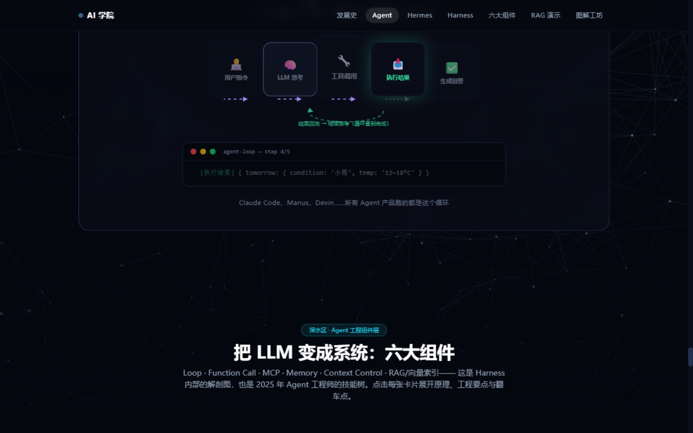
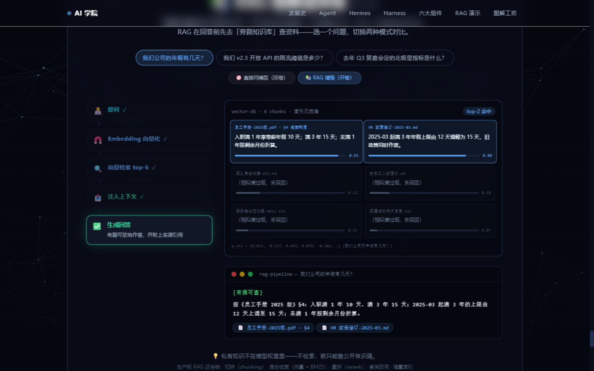

# AI 学院 · AI Learning Platform

> 一条主线讲透 AI 为什么突然能「做事」了：从 Transformer 到 Agent 工程体系，配上 Three.js 粒子背景、SVG 动画图解和可交互的演示。

    

[](https://vercel.com/new/clone?repository-url=https%3A%2F%2Fgithub.com%2FOWNER%2Fai-learning-platform)

## 🖼 截图

| 首页 | Agent 循环实时演示 |
|---|---|
|  |  |
| **六大工程组件** | **RAG 检索流水线交互演示** |
|  |  |

## ✨ 这是什么

一个**纯前端、纯内容**的 AI 概念学习站，面向想建立完整认知地图的开发者与学习者：

- **七个核心概念章节**——每章都有：摘要、要点、深度专栏、公式、正反方辩论、类比、关键事实、专属 SVG 动画图解
  1. **Transformer** —— 注意力机制的起点（含可交互注意力图解）
  2. **LLM** —— Scaling Law、RLHF 对齐与涌现（含温度采样实验台）
  3. **Agent** —— LLM + 工具 + 循环（含循环实时演示动画）
  4. **Hermes** —— 开源模型与混合推理
  5. **Harness** —— 把模型变成员工的工程系统
  6. **MCP** —— AI 应用的 USB-C：N×M 集成变 N+M
  7. **RAG** —— 旁路知识库与向量索引
- **六大工程组件解剖**（Agent Stack）：Agent Loop · Function Call / Tools · MCP · Memory · Context Control · RAG/向量索引，每张卡片含「是什么 → 工程要点 → 常见翻车点」
- **两个交互演示**：
  - **Agent Loop 实时演示**——「思考 → 工具 → 观察」循环逐帧走给你看
  - **RAG 检索流水线**——三个真实场景下「闭卷直答（幻觉）vs 开卷 RAG（带引用）」的对比动画
- **图解工坊**——全站配套插画的生图提示词，复制到即梦 / Midjourney / DALL·E 就能生成同款

## 🚀 快速开始

```bash
# 要求 Node.js >= 18.17
npm install
npm run dev        # 开发模式 → http://localhost:3000
npm run build      # 生产构建（纯静态，可部署到任何支持 Node 的平台）
npm run start      # 运行生产构建
```

## 🛠 技术栈

| 层 | 选型 | 说明 |
|---|---|---|
| 框架 | Next.js 14 (App Router) | 纯静态产出，无后端依赖 |
| UI | React 18 + Tailwind CSS | 深色极光主题，自定义 `night` / `aurora` 色板 |
| 动效 | Framer Motion | 滚动入场、章节过渡、演示动画 |
| 3D | Three.js + @react-three/fiber | 首页全息粒子背景（关闭 SSR 按需加载） |
| 图解 | 手写 SVG + CSS keyframes | 每个概念一个专属动画图解，零图片资源 |

## 📁 项目结构

```
src/
├── app/
│   ├── page.tsx              # 页面编排：章节顺序与导航
│   └── globals.css           # 主题、SVG 动画 keyframes
├── components/
│   ├── ConceptSection.tsx    # 概念章节容器（通用渲染）
│   ├── ConceptSVG.tsx        # 每个概念的专属 SVG 动画图解
│   ├── AgentLoop.tsx         # Agent 循环实时演示
│   ├── AgentStack.tsx        # 六大工程组件（架构分层图 + 可展开卡片）
│   ├── RagPipeline.tsx       # RAG 检索流水线交互演示
│   ├── Timeline.tsx / Hero.tsx / Nav.tsx / PromptDeck.tsx
│   └── NeuralBackground.tsx  # Three.js 粒子背景
└── lib/
    ├── types.ts              # Concept 类型定义
    ├── content.ts            # 内容注册表（章节顺序在这里）
    ├── content-transformer.ts / content-llm.ts / content-mcp.ts / content-rag.ts
    └── stack.ts              # 六大工程组件卡片内容
```

## 🧩 如何新增一个概念章节

1. 在 `src/lib/` 新建 `content-<id>.ts`，导出一个 `Concept` 对象（结构见 `types.ts`：summary / points / deep / formulas / debate / analogy / keyFacts / svg）
2. 在 `src/components/ConceptSVG.tsx` 里为它写一个专属 SVG 图解，并在 `SVG_MAP` 注册
3. 在 `src/lib/content.ts` 的 `CONTENT` 数组里注册（数组顺序 = 页面顺序）
4. 可选：在 `src/app/page.tsx` 的 `sections` 与 `Nav.tsx` 的 `label` 里加入导航锚点

## 🗺 Roadmap

- [ ] Function Calling 协议演示（tool_use JSON 逐帧动画）
- [ ] Memory 写入/召回演示、Context 窗口预算分配模拟器
- [ ] RAG 演示接入真实 embedding API 的可选后端
- [ ] 英文版内容（i18n）
- [ ] 概念章节的课后小测

欢迎 PR：内容纠错、新概念章节、新交互演示都在欢迎之列——内容类改动请保持「正反方辩论 + 类比」的体例，详见 [CONTRIBUTING.md](./CONTRIBUTING.md)。

## 🤝 社区

- 贡献流程与内容体例：[CONTRIBUTING.md](./CONTRIBUTING.md)
- 行为准则：[CODE_OF_CONDUCT.md](./CODE_OF_CONDUCT.md)
- 版本历史：[CHANGELOG.md](./CHANGELOG.md)
- 内容纠错 / 新章节建议：[Content issue](../../issues/new?template=content_suggestion.md) · Bug：[Bug report](../../issues/new?template=bug_report.md)

## 📄 License

[MIT](./LICENSE) —— 内容基于公开资料整理，仅供学习交流。
